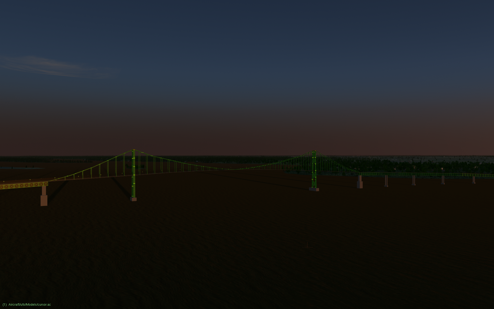

Blender model of the Ogdensburg-Prescott International Bridge
=============================================================

This is a Public Domain, medium-resolution model of the international suspension bridge across the St. Lawrence River, connecting Ogdensburg, NY, U.S.A. with Prescott, ON, Canada.  The bridge is designed with flight simulators in mind, so it is not detailed enough for close-up use (e.g. a driving simulator), but you're welcome to take it and refine it for any use you'd like.

The bridge is a major VFR landmark along the busy general-aviation route between Toronto and Montreal, and is visible from a long distance in both directions along the river.  More background:

https://en.wikipedia.org/wiki/Ogdensburg%E2%80%93Prescott_International_Bridge

Closest airport: [Ogdensburg International](https://ourairports.com/airports/KOGS/) (KOGS).

## UnLicense

This model is released into the Public Domain. See UNLICENSE.md for details.

## Author

Started by David Megginson, July 2024.  Attribution is appreciated, but not required.
